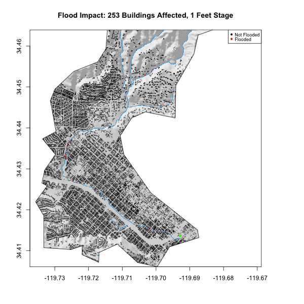

```{r setup, include=FALSE}
knitr::opts_chunk$set(echo = FALSE, warning = FALSE, message = FALSE)
```

```{r}
library(sf)        # vector manipulation
library(raster)    # raster manipulation
library(fasterize) # "faster" raster
library(whitebox)  # terrain analysis
library(tidyverse)

# Data libraries
library(osmdata)   # OSM API
library(elevatr)   # Elevation  Web Tiles
library(gifski)
```

```{r}
basin <- read_sf('https://labs.waterdata.usgs.gov/api/nldi/linked-data/nwissite/USGS-11119750/basin') 
```

```{r, eval = F}
elev_basin <- get_elev_raster(basin, z = 13) %>% crop(basin) %>% mask(basin)
elev_basin <- elev_basin*3.281

writeRaster(elev_basin, '../data/basin_elev.tif', overwrite = TRUE)

```


```{r}
elev_basin <- raster('../data/basin_elev.tif')
```


```{r}
bb <- st_bbox(basin) %>% st_as_sfc() %>% st_transform(4326)

basin_building <- opq(bb) %>% 
  add_osm_feature(key = 'building' ) %>%
  osmdata_sf()

railway <- opq(bb) %>% 
  add_osm_feature(key = 'railway', value = 'station' ) %>%
  osmdata_sf()

basin_stream <- opq(bb) %>%
  add_osm_feature(key = 'waterway', value = 'stream') %>%
  osmdata_sf()

building_poly <- basin_building$osm_polygons %>% st_intersection(basin) 

building_point <- basin_building$osm_points %>% st_intersection(basin) 

stream_line <- basin_stream$osm_lines %>% st_intersection(basin) 

railway_point <- railway$osm_points %>% st_intersection(basin) 

# ggplot() +
#   geom_sf(data = basin) +
#   geom_sf(data = building_poly) + 
#   geom_sf(data = stream_line, col = 'blue')

```

```{r, eval = FALSE}
wbt_hillshade('../data/basin_elev.tif', '../data/hillshade_basin.tif')

```

```{r}
hillshade <- raster('../data/hillshade_basin.tif')

```

# Hillshade Basin and Stream Map

<center>
```{r}
plot(hillshade, col = gray.colors(256, alpha = .5), box = FALSE, main = 'Basin and Stream')
plot(stream_line, col = 'blue', add = TRUE)
plot(basin, add = TRUE)
```
</center>


```{r, eval = FALSE}
stream_line_buff <- stream_line %>% st_transform(5070) %>% st_buffer(10) %>% st_transform(4326)

river_rast <- fasterize(stream_line_buff,  elev_basin)
```

```{r, eval = FALSE}
writeRaster(river_rast, '../data/river_basin.tif')

wbt_breach_depressions('../data/basin_elev.tif', '../data/basin_breach.tif')

wbt_elevation_above_stream('../data/basin_breach.tif', '../data/river_basin.tif', '../data/hand_basin.tif' )

```

```{r}
hand_rast <- raster('../data/hand_basin.tif')

river_rast <- raster('../data/river_basin.tif')

```

```{r}
# offset_rast <- hand_rast + 3.69
# 
# one_idx <- which(values(river_rast) == 1)
# 
# values(offset_rast)[one_idx] <- 0 

# plot(hand_rast)
# plot(river_rast, add = T, col = 'blue')

#writeRaster(offset_rast, '../data/offset_basin.tif')

offset_rast <- raster('../data/offset_basin.tif')

```

```{r}
flood_rast <- offset_rast

values(flood_rast)[which(values(flood_rast) > 10.02)] <- NA

```

# Flood Event Impact Assessment, Santa Barbara, 2017

## Flooding Map

<center>
```{r}
plot(hillshade, col = gray.colors(256, alpha = .5), box = FALSE, main = 'Basin and Flood Stream', legend = FALSE)
plot(flood_rast, col = rev(blues9), box = FALSE,  add = TRUE, legend = FALSE)
plot(railway_point, col = 'green', box = FALSE, add = TRUE, cex = 1, pch = 16)
plot(basin, box = FALSE, add = TRUE)

```
</center>

This map does seem accurate, even though it is very zoomed out. It seems the railway station is in the flood zone. 

## Flood Impact

```{r}
building_flood <- raster::extract(flood_rast, building_point)
building_point$flooded <- as.factor(ifelse(!is.na(building_flood), 1, 0))
```
<center>
```{r}
plot(hillshade, col = gray.colors(256, alpha = .5), box = FALSE, 
     main = paste('2017 Santa Barbara Basin Flood Impact:', sum(building_point$flooded==1) ,'Buildings Affected'), legend = FALSE)
plot(flood_rast, col = rev(blues9), box = FALSE,  add = TRUE, legend = FALSE)
plot(railway_point, col = 'green', box = FALSE, add = TRUE, cex = 1, pch = 16)
plot(basin, box = FALSE, add = TRUE)
plot(building_point, col = c('black','red')[building_point$flooded], box = FALSE, add = TRUE, cex = .08, pch = 16)
legend(x = 'topright', legend = c('Not Flooded', 'Flooded'), 
       col = c('black','red'), cex = .75, pch = 16)
#plot(building_point_flooded, col = 'red', box = FALSE, add = TRUE, cex = .08, pch = 16)
#plot(building_point_nonf, col = 'black', box = FALSE, add = TRUE, cex = .08, pch = 16)
```
</center>

# Flood Inundation

<center>

</center>

We are getting inundated buildings at stage 0 because we buffered the river system by 10 meters, even though the river may not be that wide. This could result in buildings which are within the buffered zone being counted as inundated, when in reality they are not.

```{r}
sb = AOI::aoi_get("Santa Barbara") 

```

```{r}
hillshade_gif <- raster('../data/hillshade_basin.tif') %>% crop(sb)

gif_rast <- offset_rast %>% crop(sb)

building_gif <- st_intersection(basin, building_point)

```

```{r, eval = F}
save_gif({
  for(i in 1:20){
    flood_gif <- gif_rast
    values(flood_gif)[which(values(flood_gif) > i)] <- NA
    
    building_flood <- raster::extract(flood_gif, building_gif)
    building_gif$flooded <- as.factor(ifelse(!is.na(building_flood), 1, 0))
    
    
    plot(hillshade_gif, col = gray.colors(256, alpha = .5), box = FALSE, 
         main = paste('Flood Impact:', sum(building_gif$flooded==1) ,'Buildings Affected,', i, 'Feet Stage'), legend = FALSE)
    plot(flood_gif, col = rev(blues9), box = FALSE,  add = TRUE, legend = FALSE)
    plot(building_point, col = c('black','red')[building_gif$flooded], box = FALSE, add = TRUE, cex = .15, pch = 16)
    plot(railway_point, col = 'green', box = FALSE, add = TRUE, cex = 1, pch = 16)
    plot(basin, box = FALSE, add = TRUE)
    legend(x = 'topright', legend = c('Not Flooded', 'Flooded'), 
       col = c('black','red'), cex = .75, pch = 16)
  }
  
}, gif_file = "../data/mission-creek-fim.gif",
   width = 600, height = 600, 
   delay = .7, loop = TRUE)

```


# Appendix

```{r ref.label= knitr::all_labels(), echo = TRUE, eval = FALSE}

```


